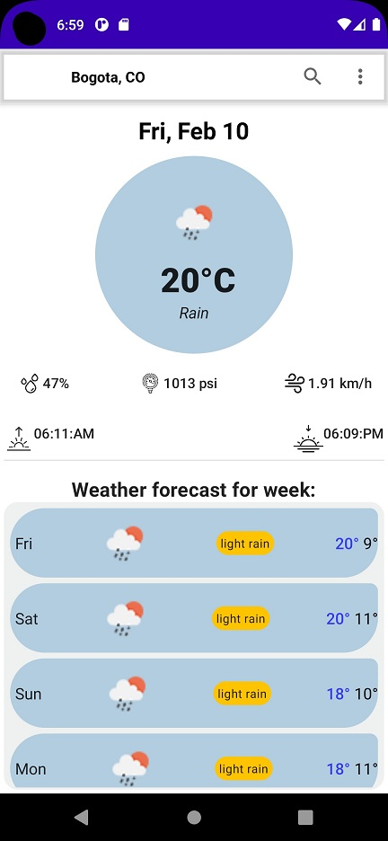
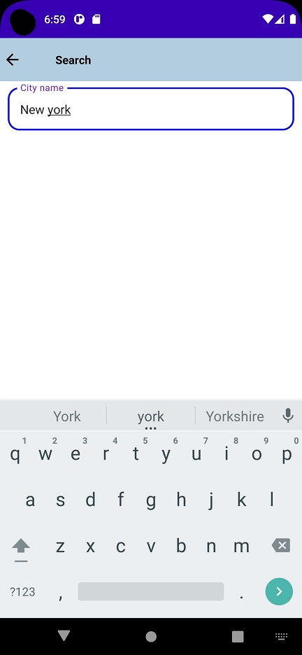
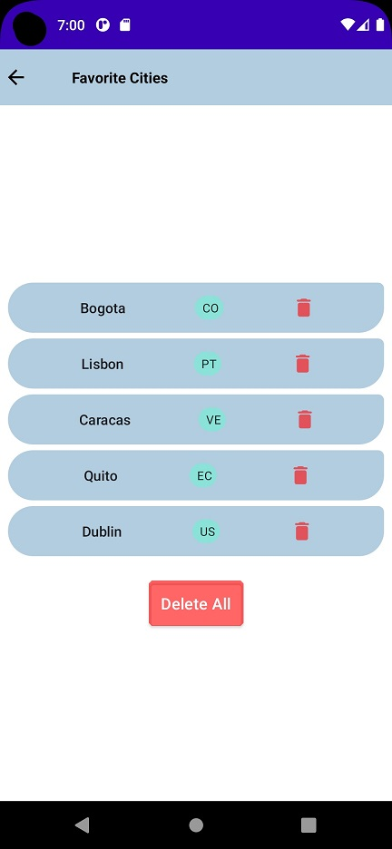

# AS-Compose-MVVM-WeatherForecast
Application that shows us the current and weekly weather forecast for any city in the world, using the OpenWeatherMap API service.

## Architecture Used
MVVM Architecture

## Libraries
- Retrofit + Gson
- Hilt + Navigation Compose
- Room
- Coil
- Coroutines
- ViewModel

## Output
 ### Main page

 ### Search page

 ### Favorites page

 ### Settings page

 ### About page

